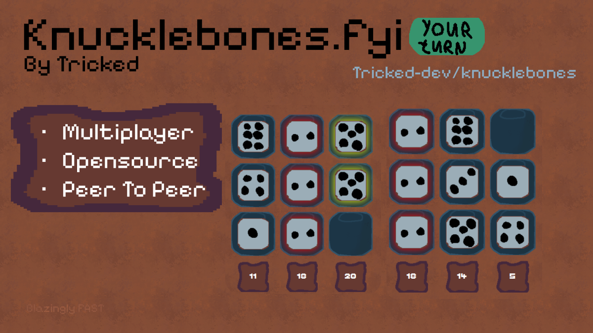

# Game

## TODO:

- Ui improvements
- Backend service to store results in
- proper logging
- look into deadlock

## Turn servers

To enable turn servers you need to set the `TURN_TOKEN_ID` and `API_TOKEN` environment variables.

These can be obtained in the new Cloudflare calls dashboard.

## License

Code is licensed user MPL-2.0

Images are under CC-0, that stuff is so ugly anyone can use it

## Contributing

- Code contributions are very welcome
- Asset edits are even more welcome any style is fine as long as it kinda looks better if you understand

## Development

The assets are generated via the `./assets.sh` script, which requires `aseprite` to be installed. Might work with libresprite haven't tested, (i compiled aseprite from source using aur)

## Font:

https://tinyworlds.itch.io/free-pixel-font-thaleah
